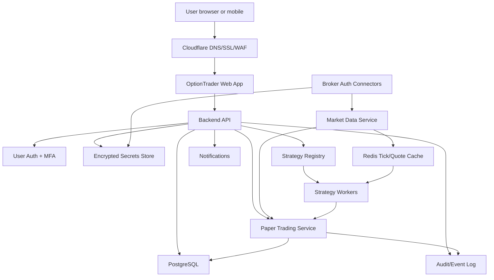
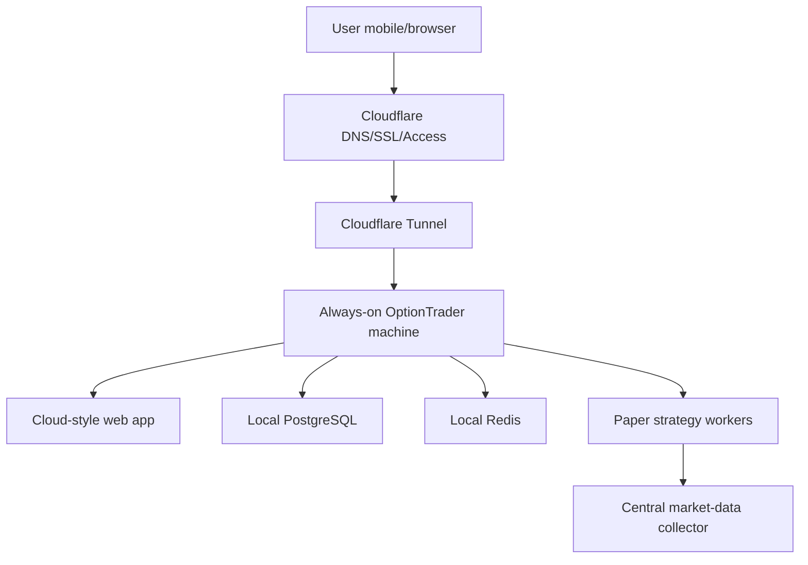
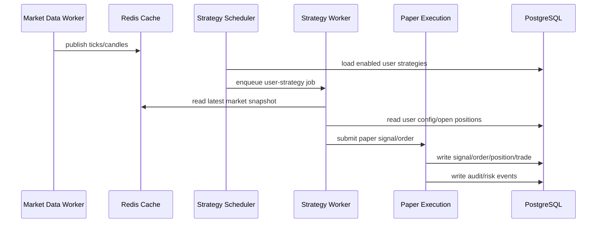
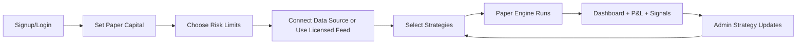

# OptionTrader Cloud Paper Platform Blueprint

Status: Planning blueprint  
Date: 2026-07-09  
Scope: Phase 1 cloud paper trading only  
Live trading scope: Explicitly out of scope until a separate compliance and execution-readiness phase

## Executive Decision

OptionTrader can become an online multi-user paper trading platform, but it must be rebuilt as a secure cloud product rather than exposing the current local dashboard.

The correct Phase 1 target is:

- Users login to an online OptionTrader Cloud app.
- Users get their own paper account, capital, settings, watchlist, strategy choices, logs, and P&L.
- Strategy logic stays server-side and remains ours.
- Strategy updates made by us become available to users through controlled version rollout.
- No real broker orders are placed in Phase 1.
- Live trading remains disabled and hidden behind a future compliance-ready Phase 2.

The key product idea is sound: let users experience our algorithms in paper mode from mobile/web without running the code locally.

## Important Market Data Decision

The biggest constraint is not Python hosting. It is market data licensing.

Using our personal paid Zerodha/Kite market data subscription to feed external users is not a safe product plan. Zerodha support states that displaying or redistributing Kite Connect API data on external platforms violates exchange data vending policies and that Kite Connect is not a data distribution service. See [Zerodha Kite Connect API FAQ](https://support.zerodha.com/category/trading-and-markets/general-kite/kite-api/articles/kite-connect-api-faqs).

Kite Connect terms also restrict redistribution and misuse of API/live market data. See [Kite Connect terms](https://kite.trade/terms/).

Therefore, Phase 1 should use one of these market-data models:

| Model | Use case | Pros | Cons | Recommendation |
|---|---|---|---|---|
| User's own broker API | Serious private paper users | Clean ownership, user authorizes their own data | Daily token/login burden remains | Good for early authenticated beta |
| Licensed market data vendor | Public paper platform | Correct for multi-user product | Monthly cost and vendor integration | Best long-term paper SaaS model |
| Our Zerodha API as shared feed | Internal testing only | Fastest for us | Likely not allowed for external users | Do not use for public/friends platform |
| Delayed/free data | Educational demo | Low cost | Not realistic for intraday options paper trading | Use only for non-trading demo |

Working rule: for friends/private beta, do not present redistributed live Kite data unless licensing is cleared. If we use our broker API internally, it should be for our own account/dev environment only.

### Central Data Cache Is Technically Possible

For a self-hosted private beta, we can technically run one market-data collector on the always-on OptionTrader machine and let all paper users consume cached normalized data from that collector.

This solves API-limit pressure:

- Subscribe/fetch each required symbol once.
- Store latest ticks/quotes/candles in Redis or an in-memory cache.
- Run all user strategies from the shared cache.
- Avoid one broker API call per user.
- Avoid duplicate historical candle calls.
- Avoid duplicate option quote polling.

But this does not solve market-data licensing by itself. If external users can see raw live quotes, charts, option LTP, candles, or values derived directly from a broker feed, that can still be treated as redistribution/display of market data. Caching reduces API calls; it does not create redistribution rights.

Safer private beta rule:

- Use central data only for internal/private paper simulation.
- Restrict users through invite-only login.
- Do not expose raw tick streams, charts, downloadable market data, or full quote tables.
- Show strategy decisions, paper trade fills, and P&L summaries only as much as needed for paper evaluation.
- Move to a licensed market-data vendor before any public/commercial release.

This is a risk-managed private beta compromise, not a public data product model.

## Sources And Constraints

Zerodha/Kite authentication:

- Kite login returns a `request_token` to the registered redirect URL.
- The server exchanges it for an `access_token`.
- Kite docs warn not to expose `api_secret` or `access_token`.
- Kite `access_token` expires the next day at 6 AM unless invalidated earlier.

Source: [Kite Connect user authentication docs](https://kite.trade/docs/connect/v3/user/)

Upstox authentication:

- Upstox uses OAuth 2 authorization code flow.
- Customer signs in on Upstox.
- The application receives a code and exchanges it server-side for an access token.
- Upstox says applications do not directly handle customer credentials.

Source: [Upstox authentication docs](https://upstox.com/developer/api-documentation/authentication/)

Dhan authentication:

- Dhan users can generate access tokens with 24-hour validity.
- Dhan supports access-token and API-key based flows.
- Dhan documents API key, secret, consent, browser login, and token consumption flow.

Source: [DhanHQ authentication docs](https://dhanhq.co/docs/v2/authentication/)

Retail algo compliance:

- NSE's implementation standards discuss algorithm registration, exchange algo IDs, algo-provider responsibilities, and order tagging.
- Algo providers must be empanelled/register algos with exchanges in the applicable live-trading model.
- Algo orders must be tagged with exchange-provided identifiers for audit trail.

Source: [NSE circular INVG67858](https://nsearchives.nseindia.com/content/circulars/INVG67858.pdf) and [NSE algo trading page](https://www.nseindia.com/static/trade/platform-services-non-neat-decision-support-tools-algorithm-trading)

Phase 1 paper trading should be built with these future live requirements in mind, but live trading must remain disabled until we are ready.

## Current Local Application

Current app shape:

- Single-user local dashboard.
- Fixed local URL: `http://127.0.0.1:8877/`.
- Local `.env` stores broker settings.
- Local `access_token.txt` stores token.
- Local JSON paper state: `data/paper_state.json`.
- Local engine command file: `data/engine_commands.jsonl`.
- Local log file: `logs.txt`.
- Local strategy config: `config/strategy.v1.nifty250_scanner_options.json`.
- Broker adapters exist under `algotrader/brokers/`.
- Paper-first execution already exists.
- Watchlist, NIFTY250 scanner, Index Options Scanner, risk gates, session rules, trailing logic, and dashboard are already implemented.

This is a good prototype foundation, but the state model and process model are not cloud/multi-user ready.

## Target Phase 1 Architecture



Core idea:

- One cloud app serves many users.
- Market data is ingested once per licensed source, cached, normalized, and used by strategy workers.
- User strategy workers read market data and produce per-user paper signals.
- Paper execution writes user-specific paper orders/trades/positions.
- Strategy code is centralized and versioned.
- Users select strategies but do not download our code.

## Hosting Strategy

### Option A: GoDaddy cPanel Only

Use for:

- Static website.
- Landing page.
- Basic documentation.
- Maybe a simple WSGI web app if Python app support exists.

Do not use for:

- Always-on strategy workers.
- WebSocket market data collectors.
- Redis/Celery queues.
- Heavy background jobs.
- Multi-user trading engine.
- Reliable production trading infrastructure.

Reason:

cPanel shared hosting is generally built for websites, not long-running workers, scheduled trading jobs, real-time tick processing, and process supervision. Even if Python WSGI is available, it is not the right execution environment for an engine that must run all market hours.

### Option B: GoDaddy Domain + Cloudflare + VPS Backend

Recommended MVP path.

Use:

- GoDaddy: domain/hosting plan can keep existing site if needed.
- Cloudflare: DNS, SSL, WAF, caching, access protection, bot protection.
- VPS/cloud server: Python backend, workers, database, Redis, scheduler.
- PostgreSQL: persistent multi-user state.
- Redis: quotes/ticks/cache/jobs.

Suggested deployment:

```text
app.yourdomain.com       -> Cloudflare -> VPS backend web/API
api.yourdomain.com       -> Cloudflare -> VPS backend API
admin.yourdomain.com     -> Cloudflare Access -> Admin dashboard
www.yourdomain.com       -> GoDaddy/cPanel marketing site
```

### Option C: AWS Mumbai Production

Recommended after private beta.

Use:

- AWS ECS/Fargate or EC2.
- RDS PostgreSQL.
- ElastiCache Redis.
- AWS Secrets Manager + KMS.
- CloudWatch logs/metrics.
- NAT Gateway with Elastic IP for static outbound broker API IP.
- ACM TLS certificates.
- S3 backups/reports.

This is more expensive but more production-grade.

### Option D: Self-Hosted Always-On Machine With Cloudflare Tunnel

Recommended first private-beta path for 5-20 users if the machine, power, and internet are reliable.

Use:

- Existing always-on OptionTrader machine as the application server.
- Cloudflare DNS and SSL for the public hostname.
- Cloudflare Tunnel from the machine to Cloudflare.
- Cloudflare Access in front of the app for invite-only access.
- Local PostgreSQL for user/trade state.
- Local Redis for market-data cache and job queue.
- Local scheduler/workers for paper strategies.
- Regular encrypted backups copied off the machine.

Public hostname example:

```text
paper.yourdomain.com
```

Traffic flow:



Benefits:

- Lowest infrastructure cost.
- Fastest path from local prototype to browser-accessible private beta.
- No router port forwarding required.
- Existing machine can reuse current Zerodha-first code during migration.
- Good enough for a small private beta if access is locked down.

Risks:

- Machine restart, Windows update, disk failure, or local network issue takes the platform down.
- Needs local backup discipline.
- Needs monitoring from outside the machine.
- Needs careful firewall and Cloudflare Access configuration.
- Still does not remove market-data licensing constraints.
- Not suitable for public/commercial live trading.

Expected capacity:

| Users | Suitability | Notes |
|---:|---|---|
| 1-5 | Good | Easy private beta range |
| 5-20 | Reasonable | Requires database, Redis cache, scheduler, and monitoring |
| 20-50 | Possible but risky | Needs profiling and better ops discipline |
| 50+ | Move to VPS/cloud | Home/self-hosted machine becomes a bottleneck |

Self-hosted Phase 1A is acceptable only if we do not expose the current local dashboard directly. The public app must be authenticated, multi-user, database-backed, and Cloudflare-protected.

## Phase 1 Product Capabilities

User-facing:

- Signup/login.
- Mobile-friendly dashboard.
- Paper capital setup.
- Risk preference setup.
- Strategy selection.
- Broker/data connection status.
- Active paper positions.
- Completed paper trades.
- Strategy leaderboard.
- Strategy-level P&L.
- Signal explanation.
- No-entry explanation.
- Daily summary.
- Token/data health warnings.

Admin-facing:

- User list.
- Strategy registry.
- Strategy version rollout.
- Feature flags.
- Per-user health.
- Market-data health.
- Worker health.
- Error logs.
- Kill switches.
- User support view.

## Multi-Tenant Rules

Tenant isolation rules:

- Every user has a separate `user_id`.
- Every paper account belongs to one user.
- Every trade belongs to one user.
- Every broker token belongs to one user.
- Every strategy setting belongs to one user.
- No API response can return another user's trades, token state, logs, or settings.
- Admin views must be explicitly permissioned and audited.

The local file model must be replaced. `data/paper_state.json` cannot be used in the cloud product.

## Database Blueprint

### users

Stores platform users.

| Column | Type | Notes |
|---|---|---|
| id | uuid | Primary key |
| email | text | Unique |
| phone | text | Optional |
| password_hash | text | If using password auth |
| mfa_enabled | bool | Required before live phase |
| role | text | user/admin/support |
| status | text | active/suspended/deleted |
| created_at | timestamptz |  |
| updated_at | timestamptz |  |

### user_profiles

Stores user display and preference information.

| Column | Type | Notes |
|---|---|---|
| user_id | uuid | FK users |
| display_name | text |  |
| timezone | text | Default Asia/Kolkata |
| preferred_currency | text | INR |
| onboarding_status | text | pending/complete |

### paper_accounts

Stores per-user simulated account.

| Column | Type | Notes |
|---|---|---|
| id | uuid | Primary key |
| user_id | uuid | FK users |
| name | text | Example: Default Paper Account |
| starting_capital | numeric | User selected |
| current_cash | numeric | Simulated cash |
| realized_pnl | numeric | Closed P&L |
| unrealized_pnl | numeric | Open P&L |
| max_daily_loss | numeric | User/admin risk setting |
| max_open_positions | int | User/admin risk setting |
| status | text | active/paused |
| created_at | timestamptz |  |

### broker_connections

Stores user broker connection metadata.

| Column | Type | Notes |
|---|---|---|
| id | uuid | Primary key |
| user_id | uuid | FK users |
| broker | text | zerodha/upstox/dhan |
| mode | text | market_data_only/paper/live_future |
| api_key_ref | text | Secret reference or encrypted value |
| api_secret_ref | text | Secret reference or encrypted value |
| redirect_uri | text | Registered callback |
| status | text | connected/expired/error |
| last_validated_at | timestamptz |  |
| created_at | timestamptz |  |

### broker_tokens

Stores short-lived broker tokens in encrypted form.

| Column | Type | Notes |
|---|---|---|
| id | uuid | Primary key |
| broker_connection_id | uuid | FK broker_connections |
| token_ciphertext | text | Encrypted |
| token_type | text | access_token |
| expires_at | timestamptz | Broker-specific |
| generated_at | timestamptz |  |
| revoked_at | timestamptz | Nullable |

Important:

- Never log raw token values.
- Prefer a cloud secrets manager or envelope encryption with KMS.

### market_data_sources

Defines available market data providers.

| Column | Type | Notes |
|---|---|---|
| id | uuid | Primary key |
| provider | text | zerodha/upstox/dhan/vendor |
| license_scope | text | personal/internal_beta/redistributable |
| status | text | active/paused/error |
| supports_ticks | bool |  |
| supports_historical | bool |  |
| max_symbols | int |  |
| notes | text |  |

### instruments

Normalized instrument master.

| Column | Type | Notes |
|---|---|---|
| id | uuid | Primary key |
| broker | text | zerodha/upstox/dhan/vendor |
| exchange | text | NSE/NFO/BSE/BFO |
| tradingsymbol | text |  |
| instrument_token | text | Broker/vendor token |
| instrument_type | text | EQ/OPTIDX/OPTSTK/INDEX |
| underlying | text |  |
| expiry | date | Nullable |
| strike | numeric | Nullable |
| option_side | text | CE/PE |
| lot_size | int |  |

### strategy_definitions

Canonical strategies owned by us.

| Column | Type | Notes |
|---|---|---|
| id | uuid | Primary key |
| slug | text | Unique |
| display_name | text | User visible |
| family | text | index/options/scanner/watchlist |
| owner | text | OptionTrader |
| status | text | draft/beta/active/retired |
| public_description | text | User visible |
| risk_label | text | low/medium/high |

### strategy_versions

Immutable strategy release versions.

| Column | Type | Notes |
|---|---|---|
| id | uuid | Primary key |
| strategy_id | uuid | FK strategy_definitions |
| version | text | Example: 1.4.0 |
| config_schema | jsonb | Allowed settings |
| default_config | jsonb | Default risk/config |
| code_ref | text | Git commit or package tag |
| rollout_status | text | internal/beta/stable/disabled |
| created_at | timestamptz |  |

### user_strategy_settings

Per-user strategy enablement and config.

| Column | Type | Notes |
|---|---|---|
| id | uuid | Primary key |
| user_id | uuid | FK users |
| paper_account_id | uuid | FK paper_accounts |
| strategy_version_id | uuid | FK strategy_versions |
| enabled | bool |  |
| user_config | jsonb | User overrides |
| risk_config | jsonb | Per-strategy risk |
| rollout_channel | text | stable/beta |
| created_at | timestamptz |  |

### signal_events

Every strategy decision event.

| Column | Type | Notes |
|---|---|---|
| id | uuid | Primary key |
| user_id | uuid | FK users |
| strategy_version_id | uuid | FK strategy_versions |
| symbol | text | Underlying |
| instrument | text | Option/future/equity |
| side | text | CE/PE/BUY/SELL/none |
| score | numeric | Strategy score |
| action | text | enter/skip/exit/update |
| reason | text | Human explanation |
| features | jsonb | RSI, EMA gap, momentum, etc. |
| created_at | timestamptz |  |

### paper_orders

Simulated orders.

| Column | Type | Notes |
|---|---|---|
| id | uuid | Primary key |
| user_id | uuid | FK users |
| paper_account_id | uuid | FK paper_accounts |
| strategy_version_id | uuid | FK strategy_versions |
| signal_event_id | uuid | FK signal_events |
| exchange | text |  |
| tradingsymbol | text |  |
| transaction_type | text | BUY/SELL |
| quantity | int |  |
| order_type | text | MARKET/LIMIT simulation |
| requested_price | numeric | Signal price |
| fill_price | numeric | Simulated fill |
| status | text | filled/rejected/cancelled |
| reject_reason | text | Nullable |
| created_at | timestamptz |  |

### paper_positions

Open and closed simulated positions.

| Column | Type | Notes |
|---|---|---|
| id | uuid | Primary key |
| user_id | uuid | FK users |
| paper_account_id | uuid | FK paper_accounts |
| strategy_version_id | uuid | FK strategy_versions |
| tradingsymbol | text |  |
| underlying | text |  |
| option_side | text | CE/PE |
| quantity | int |  |
| entry_price | numeric | Never mutated |
| current_price | numeric | Live/current simulated price |
| stop_loss | numeric | May trail |
| target | numeric | May extend |
| status | text | open/closed |
| opened_at | timestamptz |  |
| closed_at | timestamptz | Nullable |

### paper_trades

Closed trade ledger.

| Column | Type | Notes |
|---|---|---|
| id | uuid | Primary key |
| position_id | uuid | FK paper_positions |
| exit_reason | text | target/sl/manual/session/risk |
| exit_price | numeric | Simulated exit |
| gross_pnl | numeric |  |
| charges | numeric | Simulated charges |
| net_pnl | numeric |  |
| closed_at | timestamptz |  |

### audit_events

Security and operational audit trail.

| Column | Type | Notes |
|---|---|---|
| id | uuid | Primary key |
| user_id | uuid | Nullable for system events |
| actor_type | text | user/admin/system/worker |
| event_type | text | login/token/update/strategy/order/risk |
| entity_type | text | strategy/account/broker/order |
| entity_id | uuid | Nullable |
| ip_address | inet | Nullable |
| metadata | jsonb | No secrets |
| created_at | timestamptz |  |

## Paper Execution Rules

Phase 1 must be honest paper trading, not fantasy fills.

Paper fill rules:

- Use real tradable instruments where available.
- Use option LTP or bid/ask midpoint if licensed data has depth.
- Apply configurable slippage.
- Apply brokerage/charges model.
- Reject fills if quote unavailable.
- Reject fills if premium below minimum.
- Reject fills if spread too wide.
- Reject fills if volume/open-interest filters fail.
- Keep `entry_price` fixed.
- Only update `current_price`, `stop_loss`, `target`, and trailing metadata.

## Strategy Rollout Model

Strategy source code remains private and server-side.

Rollout levels:

- `internal`: only admin/dev account.
- `beta`: selected test users.
- `stable`: visible to normal paper users.
- `retired`: no new enablement, existing positions managed only.
- `disabled`: all new entries blocked.

Versioning rules:

- Existing paper trades keep the strategy version that created them.
- New strategy versions do not rewrite historical trades.
- Each strategy version has a changelog.
- Admin can roll out gradually.
- Admin can disable new entries globally if performance degrades.

## User Strategy Selection

Users may select from approved paper strategies:

- NIFTY250 2m Engulfing Scanner.
- Index Options Scanner.
- Watchlist Directional Stock CE.
- Watchlist Directional Stock PE.
- Future strategies we add.

Users can configure:

- Paper capital.
- Max daily loss.
- Max open positions.
- Strategy enable/disable.
- Strategy risk budget.
- Watchlist symbols where applicable.
- Paper reset, if explicitly allowed.

Users cannot configure:

- Hidden strategy formula internals.
- Global risk hard floors.
- Data source license.
- Other users' settings.
- Live trading in Phase 1.

## Engine Scheduling Model

Do not run one full engine process per user if we can avoid it. That scales badly.

Recommended Phase 1 worker model:



Minimum scheduler behavior:

- Run market-data ingestion once.
- Run strategy jobs per enabled user/strategy.
- Debounce duplicate calculations.
- Cap worker concurrency.
- Skip jobs if data is stale.
- Mark strategy health per user.
- Do not block one user because another user has an issue.

## Security Blueprint

Minimum Phase 1 security:

- HTTPS only.
- Secure cookies.
- CSRF protection for browser actions.
- MFA-ready user model.
- Rate limiting for login/API.
- Password hashing with Argon2 or bcrypt.
- Session expiration.
- Per-user authorization checks on every query.
- Encrypted broker credentials/tokens.
- Secrets never printed in logs.
- Admin actions audited.
- User data export/delete workflow later.
- Environment secrets outside Git.
- Database backup encryption.
- Separate dev/staging/prod environments.

For admin access:

- Use Cloudflare Access or equivalent.
- Restrict admin dashboard to named admin accounts.
- Audit every admin view/edit.

## Observability

We need visibility before users are onboarded.

Metrics:

- Market data freshness by symbol.
- Candle readiness by strategy.
- Worker lag.
- Queue depth.
- User strategy job failures.
- Broker token expiration count.
- Paper order reject count.
- P&L by strategy/version.
- Error rate.
- API latency.

Alerts:

- Market data stale.
- Worker stopped.
- Database unavailable.
- Redis unavailable.
- Error spike.
- All strategies no-entry for too long due system issue.
- Token callback failures.
- Strategy version abnormal loss cluster.

## Cloud Paper Platform Flow



## GoDaddy, Cloudflare, And Backend Split

Recommended practical setup:

| Layer | Tool | Role |
|---|---|---|
| Domain | GoDaddy | Domain ownership or current hosting plan |
| DNS/SSL/WAF | Cloudflare | Route/protect app traffic |
| Marketing site | GoDaddy cPanel or static host | Public landing/docs |
| App frontend | VPS/app server | Authenticated user dashboard |
| Backend API | VPS/app server | User, paper, strategies, auth |
| Workers | VPS/app server | Strategy scheduler and market data |
| Database | PostgreSQL | Persistent state |
| Cache/queue | Redis | Ticks, jobs, worker coordination |

Early MVP can be a single VPS with Docker Compose:

```text
nginx/caddy
backend API
worker
scheduler
postgres
redis
```

Later production should split these services.

## Implementation Roadmap

### Milestone 0: Self-Hosted Phase 1A Decision

Deliverables:

- Confirm always-on machine as private beta host.
- Confirm public hostname, for example `paper.yourdomain.com`.
- Configure Cloudflare Tunnel and Cloudflare Access.
- Keep current `http://127.0.0.1:8877/` dashboard local-only.
- Define private-beta market-data policy.
- Add external health check.
- Add backup plan.

Exit criteria:

- Only invited users can reach the app.
- No router port is publicly opened.
- The current local dashboard is not directly exposed.
- We have a clear decision on whether private beta uses central data cache, user broker APIs, or a licensed feed.

### Milestone 1: Product And Architecture Baseline

Deliverables:

- This blueprint.
- UI specification.
- Multi-user data model.
- Hosting decision.
- Market-data decision.
- Phase 1 non-goals.

Exit criteria:

- We agree that Phase 1 is paper-only.
- We agree not to redistribute Kite data to external users without permission.
- We agree on MVP hosting plan.

### Milestone 2: Database Foundation

Deliverables:

- Add PostgreSQL support.
- Add SQLAlchemy or equivalent ORM.
- Add migrations.
- Add tables for users, paper accounts, strategies, paper orders, positions, trades, audit events.
- Keep local JSON mode working until migration is complete.

Exit criteria:

- A single local user can run paper trading from database state.
- Tests cover persistence.

### Milestone 3: User Auth And Tenant Isolation

Deliverables:

- Login/signup.
- Session management.
- User-specific paper account.
- Per-user dashboard APIs.
- Access-control tests.

Exit criteria:

- User A cannot see User B data.
- Admin can see health without seeing secrets.

### Milestone 4: Strategy Registry

Deliverables:

- Strategy definitions.
- Strategy versions.
- Per-user strategy enablement.
- Feature flags/rollout channel.
- Strategy health page.

Exit criteria:

- Admin can enable a strategy version for one test user.
- New trades record strategy version.

### Milestone 5: Market Data Service

Deliverables:

- Normalize quote/tick/candle interface.
- Add licensed/provider abstraction.
- Add Redis quote cache.
- Add data freshness metrics.
- Decide vendor or user-broker model for beta.

Exit criteria:

- Strategy jobs consume centralized data snapshots.
- Stale data blocks entries with clear reason.

### Milestone 6: Multi-User Paper Engine

Deliverables:

- Scheduler.
- Worker queue.
- Per-user strategy jobs.
- Paper order simulation.
- Position management.
- Session square-off.
- Risk gates.

Exit criteria:

- 5 test users can run paper mode independently.
- Each user has separate P&L.
- Engine failure for one user does not corrupt another.

### Milestone 7: Cloud Deployment

Deliverables:

- Docker Compose or equivalent.
- Production environment variables.
- HTTPS domain.
- Cloudflare routing.
- Backup plan.
- Monitoring.

Exit criteria:

- App reachable online.
- Admin can see health.
- Test users can use mobile browser.

### Milestone 8: Private Paper Beta

Deliverables:

- Invite 2-5 trusted users.
- Paper mode only.
- Daily reports.
- Error monitoring.
- Feedback loop.

Exit criteria:

- 2-4 weeks stable paper operation.
- No data leaks.
- No repeated market-data outages.
- Strategy decisions explainable.

## Live Trading Later: Not Phase 1

Before live trading, we need:

- Legal/compliance review.
- Broker terms review.
- Algo provider/strategy registration path review.
- Static IP setup.
- Order reconciliation engine.
- Partial fill handling.
- Reject handling.
- Broker position sync.
- Live kill switch.
- User consent and risk disclosures.
- Strategy-level daily loss enforcement.
- Admin approval per user.

Do not expose live trading toggle in Phase 1.

## Open Decisions

| Decision | Options | Recommendation |
|---|---|---|
| Market data for beta | User broker API, licensed vendor, our internal feed | User API or licensed vendor |
| Hosting MVP | GoDaddy cPanel, VPS, AWS | VPS behind Cloudflare |
| Frontend stack | Existing HTML, FastAPI templates, React | Existing HTML/FastAPI first, React later |
| Database | SQLite, PostgreSQL | PostgreSQL |
| Queue | None, Redis/RQ, Celery | Redis/RQ or Celery |
| Auth | Password, Google OAuth, magic link | Password + MFA-ready first |
| Admin protection | App roles only, Cloudflare Access | Cloudflare Access + app roles |

## Immediate Next Tasks

1. Choose self-hosted Phase 1A public hostname, for example `paper.yourdomain.com`.
2. Configure Cloudflare Tunnel and Cloudflare Access for invite-only access.
3. Decide private-beta market-data policy: central cache, user broker API, or licensed feed.
4. Add PostgreSQL data model behind current paper trading.
5. Add Redis quote/cache/job layer.
6. Add user/account tables and tenant isolation tests.
7. Add strategy registry and versioning.
8. Build cloud UI shell.
9. Deploy self-hosted staging on the always-on machine.
10. Invite one internal test user before friends.

## Final Position

The cloud paper platform is feasible and commercially interesting, but it must be built with correct boundaries:

- Paper first.
- Multi-user from day one.
- Strategy code stays centralized.
- No public redistribution of our personal broker market data.
- No live orders until compliance, broker integration, reconciliation, and risk controls are production-grade.
