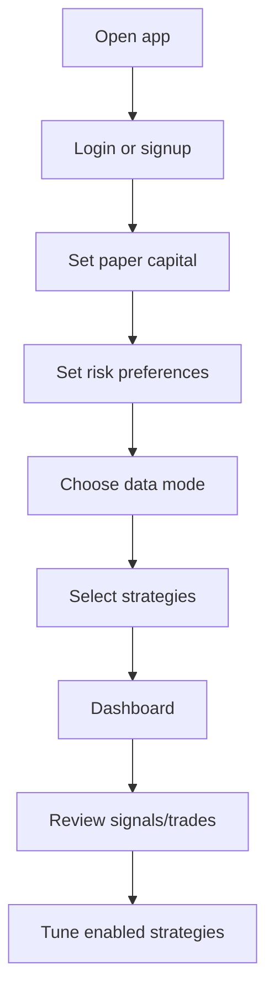
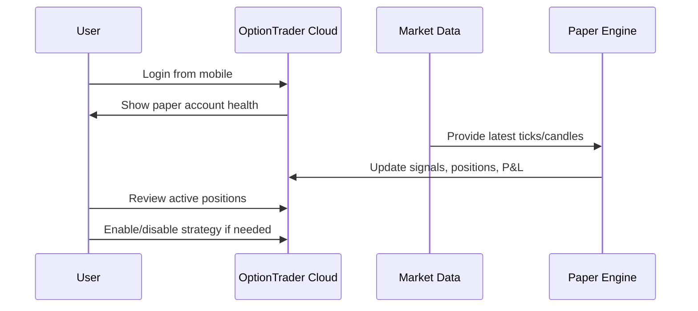

# OptionTrader Cloud Paper Platform UI Spec

Status: Figma-ready product/UI blueprint  
Date: 2026-07-09  
Scope: Phase 1 cloud paper trading platform  
Design direction: Light control-room, mobile-first, strategy marketplace, trust-first risk visibility

## UI Objective

Create a web app that lets users experience OptionTrader strategies in paper mode from mobile or desktop.

The UI must make three things obvious:

- What strategy is running.
- Why a trade was or was not taken.
- Whether the platform, data feed, and paper engine are healthy.

The app must not feel like a broker clone. It should feel like a strategy control room: calm, precise, transparent, and easy to monitor from a phone.

## Product Principles

- Paper mode is the default and only available mode in Phase 1.
- No live trading buttons in Phase 1.
- Users can select strategies, but our strategy source code stays server-side.
- Every trade must show the strategy, signal reason, risk reason, entry, stop, target, and exit reason.
- Users see only their own paper account.
- Admin screens are separate and protected.
- Mobile experience is first-class because users want to check the app away from the machine.

## Visual Direction

Theme:

- Light background.
- High contrast dark text.
- Soft financial dashboard look, not black terminal UI.
- Warm neutral panels with sharp status colors.
- Compact but not cramped.

Suggested font pairing:

- Headings: `Fraunces` or `DM Serif Display`
- Body: `IBM Plex Sans`
- Numbers: `IBM Plex Mono`

Suggested color tokens:

```css
:root {
  --bg: #f6f1e8;
  --panel: #fffaf1;
  --panel-strong: #f1e2c5;
  --text: #1f2933;
  --muted: #6b7280;
  --border: #d7c29c;
  --accent: #0f766e;
  --accent-soft: #ccfbf1;
  --profit: #15803d;
  --loss: #b42318;
  --warn: #b45309;
  --info: #2563eb;
  --disabled: #9ca3af;
}
```

## Figma Frame List

Create these frames:

| Frame | Size | Purpose |
|---|---:|---|
| `01 Mobile Login` | 390 x 844 | Mobile login/signup |
| `02 Mobile Onboarding Capital` | 390 x 844 | Paper capital and risk setup |
| `03 Mobile Data Connection` | 390 x 844 | Data/broker connection status |
| `04 Mobile Strategy Store` | 390 x 844 | Strategy selection |
| `05 Mobile Dashboard` | 390 x 844 | Daily monitoring |
| `06 Mobile Position Detail` | 390 x 844 | Trade explanation |
| `07 Desktop Dashboard` | 1440 x 1024 | Main desktop control room |
| `08 Desktop Strategy Store` | 1440 x 1024 | Browse/manage strategies |
| `09 Desktop Trade Journal` | 1440 x 1024 | Closed paper trades |
| `10 Desktop Admin Strategy Rollout` | 1440 x 1024 | Admin-only strategy publishing |
| `11 Desktop Admin System Health` | 1440 x 1024 | Admin-only ops view |

## User Roles

| Role | Access |
|---|---|
| Paper user | Own dashboard, paper account, strategy selection, own trades |
| Admin | Strategy rollout, users, system health, data-feed health |
| Support | User health and non-secret diagnostics |

## Navigation

User navigation:

- Dashboard
- Strategies
- Trades
- Account
- Data Health
- Settings

Admin navigation:

- Admin Overview
- Users
- Strategy Registry
- Rollouts
- Market Data
- Worker Health
- Audit Logs

## Main User Flow



## Daily User Flow



## Screen: Login

Purpose:

- Secure entry to cloud platform.
- Explain that Phase 1 is paper trading only.

Wireframe:

```text
+--------------------------------------+
| OptionTrader Cloud                   |
| Paper-first strategy control room    |
|                                      |
| Email                                |
| [____________________________]       |
| Password                             |
| [____________________________]       |
|                                      |
| [ Login ]                            |
|                                      |
| New here? Create paper account       |
|                                      |
| Paper mode only. No live orders.     |
+--------------------------------------+
```

Required states:

- Login loading.
- Invalid credentials.
- Account locked.
- MFA challenge, if enabled.

## Screen: Onboarding Capital

Purpose:

- Set simulated capital.
- Set initial risk guardrails.

Wireframe:

```text
+--------------------------------------+
| Setup Paper Account                  |
|                                      |
| Starting capital                     |
| [ Rs 100000                  ]       |
|                                      |
| Max daily paper loss                 |
| [ Rs 10000                   ]       |
|                                      |
| Max open positions                   |
| [ 4                         ]        |
|                                      |
| Strategy risk per trade              |
| [ 1.0%                      ]        |
|                                      |
| [ Continue ]                         |
+--------------------------------------+
```

Validation:

- Capital must be positive.
- Max daily loss must be positive.
- Max open positions must be within platform hard cap.
- User values cannot override platform hard minimums/maximums.

## Screen: Data Connection

Purpose:

- Explain whether paper trading is using an authorized shared feed, user broker data, or delayed/demo data.
- Do not hide data limitations.

Wireframe:

```text
+--------------------------------------+
| Market Data                          |
|                                      |
| Current mode                         |
| [ Licensed Paper Feed ]   ACTIVE     |
|                                      |
| Freshness                            |
| NIFTY       1s ago       OK          |
| BANKNIFTY   1s ago       OK          |
| SENSEX      2s ago       OK          |
|                                      |
| Broker connection                    |
| Zerodha     Not required for paper   |
|                                      |
| [ Continue to Strategies ]           |
+--------------------------------------+
```

Alternative states:

- User broker token required.
- Data stale.
- Vendor feed down.
- Paper engine paused due stale data.

## Screen: Strategy Store

Purpose:

- Users select which of our strategies to paper trade.
- The strategy remains ours; user sees enough to understand risk and behavior.

Wireframe:

```text
+--------------------------------------+
| Strategies                           |
| Choose paper strategies              |
|                                      |
| [Index Options Scanner]              |
| Momentum/reversal on NIFTY/BANK...   |
| Risk: High | Timeframe: 5m           |
| Status: Stable                       |
| [ Enable ] [ Details ]               |
|                                      |
| [NIFTY250 Engulfing Scanner]         |
| 2m reversal scanner across stocks    |
| Risk: High | Timeframe: 2m           |
| Status: Beta                         |
| [ Enable ] [ Details ]               |
|                                      |
| [Watchlist Directional CE/PE]        |
| User-selected stock option signals   |
| Risk: Medium                         |
| [ Enable ] [ Details ]               |
+--------------------------------------+
```

Strategy card fields:

- Strategy name.
- Plain-English behavior.
- Risk level.
- Supported instruments.
- Timeframe.
- Version.
- Current rollout channel.
- Paper-only badge.
- Enable/disable control.
- Details link.

## Screen: Strategy Detail

Purpose:

- Explain the strategy without giving away private source code.
- Show performance and conditions.

Sections:

- What it trades.
- Market condition it is designed for.
- When it avoids trades.
- Current version.
- Backtest/paper performance if available.
- User-specific settings.
- Risk settings.
- Recent signals.

Wireframe:

```text
+--------------------------------------+
| Index Options Scanner                |
| Version 1.2.0 | Paper only           |
|                                      |
| Designed for: directional index moves|
| Avoids: stale candles, wide spreads  |
|                                      |
| Symbols                              |
| [x] NIFTY [x] BANKNIFTY [x] SENSEX   |
|                                      |
| Max positions for this strategy      |
| [ 2 ]                                |
|                                      |
| Today's signals                      |
| 10:15 BANKNIFTY CE Skip: score weak  |
| 10:40 SENSEX PE Entered              |
|                                      |
| [ Save Settings ]                    |
+--------------------------------------+
```

## Screen: Mobile Dashboard

Purpose:

- Quick mobile monitoring.
- Show health first, then paper P&L, then open trades.

Wireframe:

```text
+--------------------------------------+
| OptionTrader Cloud        Paper Only |
| Data OK | Engine OK | 09 Jul 11:22   |
|                                      |
| Paper P&L Today                      |
| + Rs 1,240        +1.24%             |
|                                      |
| Open Positions                       |
| [SENSEX 76000 PE]                    |
| Entry 112.5 | LTP 126.0              |
| SL 91.0 | Target 152.0               |
| P&L + Rs 675                         |
| Reason: bearish reversal             |
| [ Details ]                          |
|                                      |
| Strategy Health                      |
| Index Scanner       Active           |
| NIFTY250 Scanner    Waiting          |
| Watchlist CE        Paused           |
|                                      |
| Recent Signals                       |
| 11:20 NIFTY skip: RSI neutral        |
| 11:18 BANK skip: stale candle        |
+--------------------------------------+
```

Top health strip:

- Data freshness.
- Engine status.
- Paper/live mode.
- Current IST time.

## Screen: Desktop Dashboard

Purpose:

- Main monitoring and analysis page.

Wireframe:

```text
+--------------------------------------------------------------------------------+
| OptionTrader Cloud                                      Paper Only | User Menu  |
+--------------------------------------------------------------------------------+
| Data OK | Engine OK | Strategies 3 active | IST 11:22 | No live orders enabled |
+--------------------------------------------------------------------------------+
| Today's Paper P&L      | Open Exposure        | Win Rate Today | Data Freshness |
| + Rs 1,240             | Rs 34,500            | 62%            | 1s             |
+--------------------------------------------------------------------------------+
| Active Positions                     | Strategy Leaderboard                   |
| SENSEX 76000 PE +675                 | Index Options Scanner   +920           |
| BANKNIFTY 54000 CE -110              | NIFTY250 Scanner        +430           |
|                                      | Watchlist CE/PE         -110           |
+--------------------------------------------------------------------------------+
| Index Options Scanner Diagnostics                                             |
| NIFTY Neutral Score 0.2 No entry: trend/RSI not aligned                       |
| BANKNIFTY Bullish Score 7.8 Entry ready: waiting risk slot                    |
| SENSEX Bearish Score 8.1 Live position open                                   |
+--------------------------------------------------------------------------------+
| Recent Signals And Risk Logs                                                  |
| 11:20 SENSEX entered PE: bearish score 8.1                                    |
| 11:18 NIFTY skip: score below threshold                                       |
+--------------------------------------------------------------------------------+
```

Desktop layout:

- Header.
- System health rail.
- KPI cards.
- Two-column content grid.
- Active positions left.
- Strategy leaderboard right.
- Diagnostics full width.
- Logs bottom.

## Screen: Position Detail

Purpose:

- Make one paper trade fully explainable.

Fields:

- Strategy and version.
- Underlying.
- Contract.
- Option side.
- Entry time.
- Entry price.
- Current LTP.
- Stop loss.
- Target.
- Quantity.
- Simulated charges.
- Net P&L.
- Signal features.
- Risk checks passed.
- Exit plan.
- Timeline.

Wireframe:

```text
+--------------------------------------+
| SENSEX 76000 PE                      |
| Index Options Scanner v1.2.0         |
|                                      |
| Entry      112.50                    |
| LTP        126.00                    |
| SL          91.00                    |
| Target     152.00                    |
| Qty         20                       |
| P&L        + Rs 675                  |
|                                      |
| Why entered                          |
| Regime: bearish                      |
| Score: 8.1                           |
| RSI: 42.3                            |
| Momentum: -0.18%                     |
| EMA gap: -0.09%                      |
| Candle: closed 11:15                 |
|                                      |
| Risk checks                          |
| Premium cap: passed                  |
| Daily loss: passed                   |
| Open slots: passed                   |
| Spread: passed                       |
|                                      |
| Timeline                             |
| 11:15 Signal created                 |
| 11:16 Paper buy filled               |
| 11:20 LTP updated                    |
+--------------------------------------+
```

## Screen: Trade Journal

Purpose:

- Review completed paper trades.
- Filter by user strategy, date, symbol, win/loss.

Columns:

- Date/time.
- Strategy.
- Symbol/contract.
- Side.
- Entry.
- Exit.
- Qty.
- Charges.
- Net P&L.
- Exit reason.
- Signal score.

Filters:

- Date range.
- Strategy.
- Symbol.
- Result.
- Exit reason.

## Screen: Data Health

Purpose:

- Users know whether the platform is safe to trust for paper signals.

Fields:

- Feed provider.
- Last tick time.
- Last candle time.
- Symbols stale.
- Historical data status.
- Broker token status if user broker mode is used.
- Stale data blocking status.

Wireframe:

```text
+--------------------------------------+
| Data Health                          |
|                                      |
| Provider: Licensed Feed              |
| Overall: OK                          |
|                                      |
| NIFTY      Tick 1s | Candle 5m OK    |
| BANKNIFTY  Tick 1s | Candle 5m OK    |
| SENSEX     Tick 2s | Candle 5m OK    |
|                                      |
| Blocking new entries: No             |
| Last issue: None                     |
+--------------------------------------+
```

## Screen: Admin Strategy Rollout

Purpose:

- Admin can publish, beta-test, disable, or retire strategies.

Wireframe:

```text
+--------------------------------------------------------------------------------+
| Admin: Strategy Rollout                                                        |
+--------------------------------------------------------------------------------+
| Strategy                 Version   Channel   Users   Today P&L   Actions       |
| Index Options Scanner    1.2.0     stable    12      +4300       Disable New   |
| NIFTY250 Scanner         1.8.1     beta      4       -900        Promote       |
| Watchlist CE/PE          1.1.0     stable    8       +1200       View          |
+--------------------------------------------------------------------------------+
| Version Details                                                                |
| Changelog: tightened chop filter                                               |
| Rollout notes: beta for 3 days before stable                                   |
+--------------------------------------------------------------------------------+
```

Admin actions:

- Create strategy definition.
- Add new version.
- Assign beta users.
- Promote to stable.
- Disable new entries.
- Retire strategy.
- View strategy performance.

Every admin action must create an audit event.

## Screen: Admin System Health

Purpose:

- Operational control room.

Panels:

- API health.
- Database health.
- Redis health.
- Worker queue depth.
- Market data freshness.
- Error rate.
- User count.
- Active paper positions.
- Strategy failure count.
- Token callback failures.

## Component Library

### AppShell

Contains:

- Top nav.
- Mode badge.
- Health strip.
- Main content.
- Mobile bottom nav.

### StatusPill

States:

- `OK`
- `Waiting`
- `Stale`
- `Blocked`
- `Error`
- `Paper Only`

### StrategyCard

Fields:

- Name.
- Version.
- Risk label.
- Strategy family.
- Description.
- Status.
- Enable toggle.
- Detail button.

### TradeCard

Fields:

- Contract.
- Underlying.
- Strategy.
- Entry.
- LTP.
- SL.
- Target.
- P&L.
- Quote status.
- Reason.

### SignalReasonPanel

Fields:

- Regime.
- Score.
- Bias.
- RSI.
- Momentum.
- EMA gap.
- Candle readiness.
- Risk gates.
- Final decision.

### RiskSettingInput

Fields:

- Label.
- Current value.
- Platform min/max.
- Warning message.

### DataFreshnessBadge

Fields:

- Provider.
- Last tick age.
- Last candle age.
- Blocking flag.

## Data Contracts

### Dashboard Summary

```json
{
  "mode": "paper",
  "data_status": "ok",
  "engine_status": "running",
  "paper_account": {
    "starting_capital": 100000,
    "current_value": 101240,
    "today_pnl": 1240,
    "open_exposure": 34500
  },
  "strategy_health": [
    {
      "strategy_slug": "index_options_scanner",
      "display_name": "Index Options Scanner",
      "status": "active",
      "today_pnl": 920,
      "open_positions": 1
    }
  ]
}
```

### Strategy Signal

```json
{
  "strategy_slug": "index_options_scanner",
  "strategy_version": "1.2.0",
  "symbol": "SENSEX",
  "side": "PE",
  "action": "enter",
  "score": 8.1,
  "reason": "Bearish regime, RSI and EMA gap aligned, candle closed.",
  "features": {
    "rsi": 42.3,
    "momentum_pct": -0.18,
    "ema_gap_pct": -0.09,
    "last_candle_time": "2026-07-09T11:15:00+05:30"
  }
}
```

### Paper Position

```json
{
  "tradingsymbol": "SENSEX2670976000PE",
  "underlying": "SENSEX",
  "strategy": "Index Options Scanner",
  "strategy_version": "1.2.0",
  "quantity": 20,
  "entry_price": 112.5,
  "current_price": 126.0,
  "stop_loss": 91.0,
  "target": 152.0,
  "net_pnl": 675,
  "quote_status": "live",
  "opened_at": "2026-07-09T11:16:02+05:30"
}
```

## Mobile Behavior

Mobile priorities:

1. Health.
2. Today's P&L.
3. Open positions.
4. Strategy health.
5. Recent reasons/logs.

Do not show giant tables on mobile. Use cards and detail pages.

Mobile bottom nav:

- Home
- Strategies
- Trades
- Data
- Account

## Empty States

No strategies enabled:

```text
No paper strategies enabled yet.
Choose one strategy to start simulated trading.
```

No trades today:

```text
No paper trades today.
The engine is running, but no strategy found a valid entry.
```

Data stale:

```text
Market data is stale.
New entries are blocked until fresh data resumes.
Open paper positions will show last known prices.
```

Paper engine stopped:

```text
Paper engine is paused.
No new signals are being evaluated.
```

## Error States

Do not show Python tracebacks to users.

User-facing format:

```text
What happened:
Market data for BANKNIFTY is stale.

Impact:
New BANKNIFTY paper entries are blocked.

Next step:
No action needed. The engine will resume automatically when data is fresh.
```

Admin-facing details can include error IDs and stack traces, but never secrets.

## Accessibility

Minimum requirements:

- Color is never the only status indicator.
- All status pills include text.
- Font size readable on mobile.
- P&L uses sign, color, and label.
- Buttons have clear disabled state.
- Forms have validation text.
- Charts must have table fallback.

## UI Build Order

1. Cloud app shell.
2. Login/signup.
3. Paper onboarding.
4. Dashboard summary.
5. Strategy Store.
6. Active positions.
7. Signal reasons.
8. Trade journal.
9. Data health.
10. Admin strategy rollout.
11. Admin system health.

## Figma Handoff Notes

If this is recreated in Figma:

- Use the frame names listed above.
- Create components for status pills, cards, data badges, and strategy toggles.
- Create mobile and desktop variants.
- Add prototype links:
  - Login -> Onboarding -> Data Connection -> Strategy Store -> Dashboard.
  - Dashboard position card -> Position Detail.
  - Dashboard strategy card -> Strategy Detail.
  - Admin Strategy Rollout -> Version Details.
- Mark all live-trading UI as out of scope for Phase 1.

## Final UI Position

The Phase 1 UI should sell trust, not excitement.

The user should always know:

- This is paper trading.
- Which strategy is active.
- Why entries happen.
- Why entries do not happen.
- Whether data is fresh.
- What their simulated risk and P&L are.

