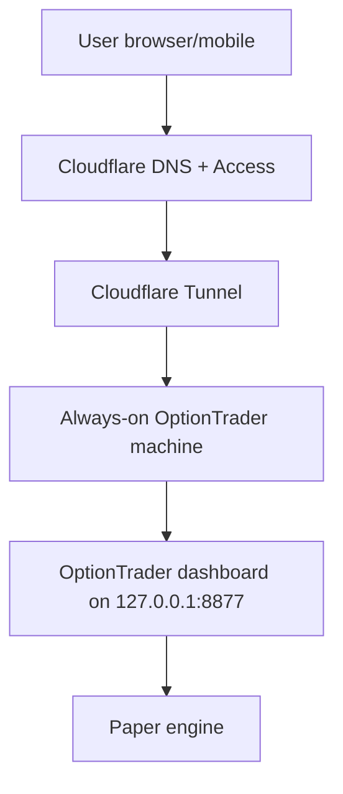

# OptionTrader Self-Hosted Private Beta Runbook

Status: Implementation runbook  
Date: 2026-07-09  
Scope: Phase 1A self-hosted paper trading beta  
Important: This is paper trading only. Do not expose live trading.

## Goal

Run OptionTrader from the always-on `C:\OptionTrader` machine and let invited users reach it through a protected browser URL.

Recommended public URL pattern:

```text
https://paper.yourdomain.com
```

The local dashboard remains fixed at:

```text
http://127.0.0.1:8877/
```

Do not expose the local dashboard directly through router port forwarding.

## Architecture



## What Was Reused From AlgoTrader

`C:\AlgoTrader` uses a `start_all.ps1` pattern:

- Start local dashboard.
- Start `cloudflared`.
- Use either quick tunnel or named tunnel from `%USERPROFILE%\.cloudflared\config.yml`.

OptionTrader uses the same idea, but safer:

- It keeps port `8877`.
- It uses a separate Cloudflare config file:

```text
%USERPROFILE%\.cloudflared\optiontrader.yml
```

- It does not overwrite AlgoTrader's existing Cloudflare config.
- It can enable an app-level Cloudflare Access guard.

## Files Added

| File | Purpose |
|---|---|
| `start_self_hosted_beta.cmd` | Execution-policy-safe Windows wrapper for the self-hosted launcher |
| `start_self_hosted_beta.ps1` | Starts OptionTrader dashboard and Cloudflare tunnel |
| `tools/new_optiontrader_cloudflare_config.ps1` | Generates `%USERPROFILE%\.cloudflared\optiontrader.yml` |
| `deploy/cloudflare/optiontrader.yml.example` | Example checked-in Cloudflare tunnel config |
| `tests/test_cloud_access_guard.py` | Regression tests for dashboard Cloudflare Access guard |

## Security Model

There are two protection layers:

1. Cloudflare Access in front of the public hostname.
2. Optional app-level guard inside OptionTrader.

When the app-level guard is enabled:

- Local browser access to `127.0.0.1:8877` still works.
- Public hostname requests must include Cloudflare Access identity header:

```text
Cf-Access-Authenticated-User-Email
```

- Optional email allowlist can further restrict access.

Environment variables used by the guard:

```text
OPTIONTRADER_CLOUD_ACCESS_REQUIRED=1
OPTIONTRADER_CLOUD_ALLOWED_EMAILS=owner@example.com,friend@example.com
OPTIONTRADER_CLOUD_LOCAL_BYPASS=1
```

The `start_self_hosted_beta.ps1` script sets these when `-CloudAccessGuard` is used.

## One-Time Cloudflare Setup

These steps require your Cloudflare account/domain access.

1. Install `cloudflared` if it is not already installed.
2. Login:

```powershell
cloudflared tunnel login
```

3. Create a separate OptionTrader tunnel:

```powershell
cloudflared tunnel create optiontrader
```

This prints a tunnel ID and creates a credential JSON under:

```text
%USERPROFILE%\.cloudflared\
```

4. Route your desired hostname to the tunnel:

```powershell
cloudflared tunnel route dns optiontrader paper.yourdomain.com
```

5. Generate the OptionTrader-specific config:

```powershell
cd C:\OptionTrader
powershell -NoProfile -ExecutionPolicy Bypass -File .\tools\new_optiontrader_cloudflare_config.ps1 `
  -TunnelId YOUR_OPTIONTRADER_TUNNEL_ID `
  -Hostname paper.yourdomain.com
```

This writes:

```text
%USERPROFILE%\.cloudflared\optiontrader.yml
```

6. Configure Cloudflare Access for:

```text
paper.yourdomain.com
```

Recommended policy:

- Application type: Self-hosted
- Session duration: 8-12 hours
- Allowed emails: only you and invited beta users
- Require one-time PIN or identity provider login

Do not skip Cloudflare Access.

## Start Private Beta

Recommended protected start:

```powershell
cd C:\OptionTrader
.\start_self_hosted_beta.cmd `
  -CloudAccessGuard `
  -AllowedEmails "you@example.com,friend1@example.com" `
  -Hostname paper.yourdomain.com
```

Temporary quick tunnel for local testing only:

```powershell
.\start_self_hosted_beta.cmd -QuickTunnel
```

Do not share quick tunnel links for trading/paper beta. Quick tunnels are temporary and do not enforce your named Cloudflare Access policy.

## How To Verify

Local:

```powershell
Invoke-WebRequest http://127.0.0.1:8877/ -UseBasicParsing
```

Public:

```text
Open https://paper.yourdomain.com
```

Expected:

- Cloudflare asks for login/OTP.
- After successful login, OptionTrader dashboard loads.
- The dashboard still says paper mode.
- Local `http://127.0.0.1:8877/` continues to work on the machine.

If public access shows `Cloudflare Access login is required for this OptionTrader endpoint`, then Cloudflare Access is not passing the identity header to the origin or the hostname is not configured as an Access application.

## What This Does Not Yet Solve

This runbook makes the current OptionTrader dashboard securely reachable through a protected domain.

It does not yet provide true multi-user paper separation.

Still needed for full 5-20 user Phase 1A:

- User login inside OptionTrader.
- Per-user paper accounts.
- Database instead of `data/paper_state.json`.
- Per-user strategy selections.
- Admin dashboard.
- Central market-data cache.
- Redis worker queue.
- Tenant isolation tests.

Until those are built, invited users should be treated as viewers/testers of the same paper system, not separate independent paper accounts.

## Market Data Reminder

Centralizing data on this machine can reduce broker API calls, but it does not automatically grant rights to redistribute market data.

Use central broker-fed data only for private/internal beta unless the data provider/license permits external users.

For public/commercial paper users, use:

- Each user's own authorized broker/data account, or
- A licensed market-data vendor.

## Rollback

To stop the self-hosted beta:

1. Close the Cloudflare tunnel PowerShell window.
2. Close the OptionTrader dashboard PowerShell window.
3. Confirm local dashboard is stopped:

```powershell
Invoke-WebRequest http://127.0.0.1:8877/ -UseBasicParsing
```

It should fail if the dashboard is fully stopped.

No paper state is deleted by this process.
